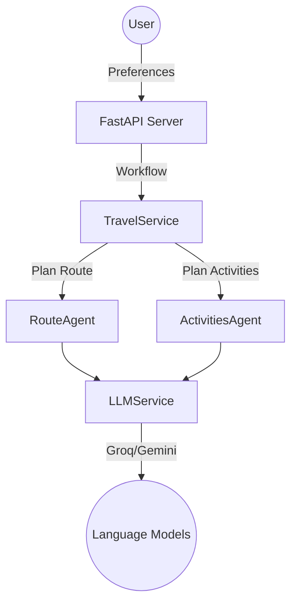
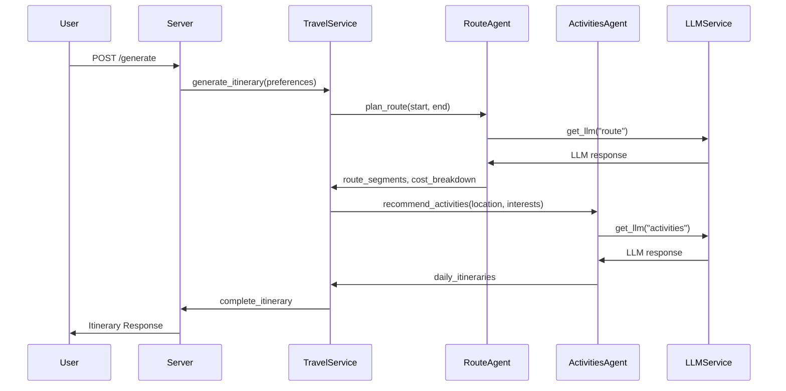
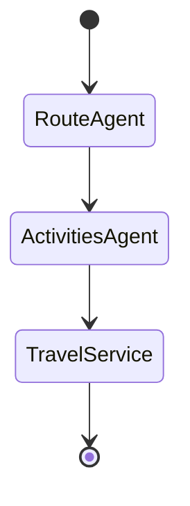

# Multi-Agent Travel Planner

This is a backend application for generating personalized travel itineraries using a multi-agent system and language models (LLMs). It takes user preferences as input and outputs a complete itinerary including routes, activities, and cost breakdown.

## Architecture

The system is built using Python and the FastAPI framework. It follows a multi-agent architecture with the following key components:

1. **TravelService**: Orchestrates the itinerary generation process using a StateGraph workflow. Initializes and coordinates the agents.

2. **RouteAgent**: Plans the optimal travel route between the start and end locations. Interacts with an LLM to generate human-friendly route descriptions.

3. **ActivitiesAgent**: Suggests activities for each location based on user preferences and creates a daily schedule. Also uses an LLM for generating activity descriptions.

4. **LLMService**: Provides access to the language models (Groq or Google Gemini) used by the agents for generating text.

5. **Schemas**: Defines the data models for user preferences, route segments, activities, daily itineraries, and the complete itinerary using Pydantic.

6. **Config**: Handles configuration settings using Pydantic Settings and a .env file.

## Interaction Flow

1. User sends a POST request to the `/generate` endpoint with their travel preferences.

2. The `TravelService` creates a StateGraph workflow with nodes for route planning, activity planning, and finalization.

3. The `RouteAgent` plans the overall route:
   - Sends a prompt to the LLM (via `LLMService`) to describe the route
   - Parses the LLM response to extract structured route segments
   - Calculates cost breakdown for transportation and other categories

4. The `ActivitiesAgent` suggests activities for each location:
   - Queries the LLM for activity ideas based on user preferences
   - Parses activity details from the LLM response
   - Creates a daily schedule with selected activities

5. The `TravelService` combines the route and activity results into a `CompleteItinerary`

6. The itinerary is returned to the user as the response to their POST request

## StateGraph Workflow

The `TravelService` uses a `StateGraph` to define the workflow between the `RouteAgent` and `ActivitiesAgent`. This allows for a clear separation of concerns and a modular architecture.

## Potential Improvements

- More robust error handling and retry logic in case of LLM failures
- Caching of frequently requested routes and activities to improve response time
- Integration with real-world booking APIs for flights, hotels, etc.
- Enhanced personalization based on user preferences and past behavior
- Interactive itinerary refinement allowing users to customize their trips
- Improved natural language understanding for more flexible user inputs

## Getting Started

1. Clone the repository
2. Install dependencies: `pip install -r requirements.txt`
3. Set up your `.env` file with API keys for the LLMs
4. Start the server: `uvicorn app.main:app --reload` 
5. Send a POST request to `http://localhost:8000/generate` with your travel preferences

Feel free to explore the code and adapt it to your needs. Happy travels!